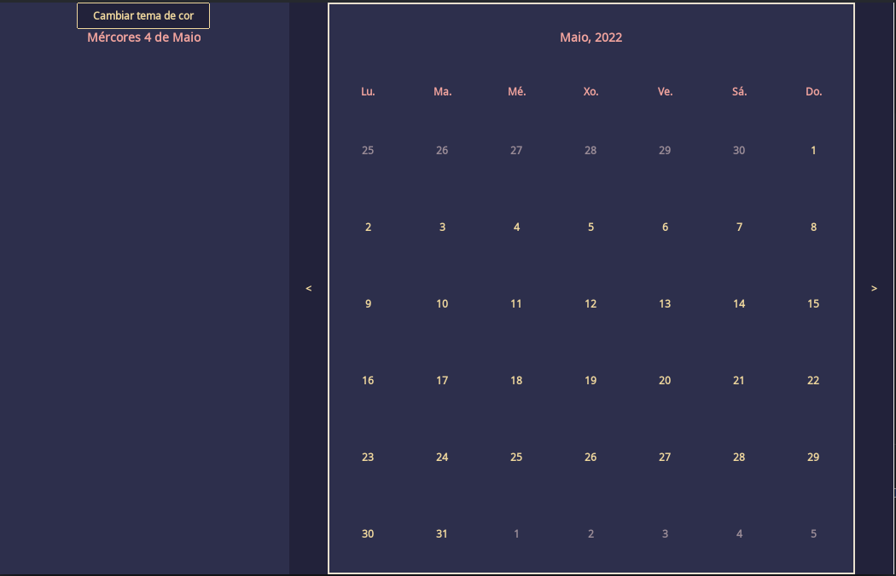
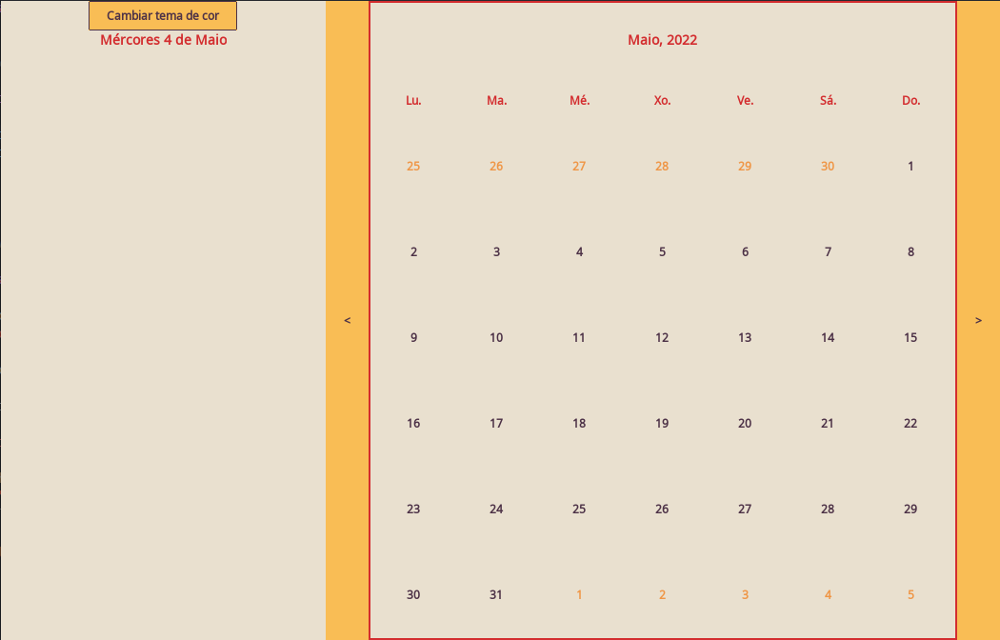

# Calendario

Aplicación feita en java con swing. Aplicación de calendario con varios usuarios e con eventos.

- Os usuarios poden rexistrarse e iniciar sesión ao comezo do programa.
- Despois de iniciar sesión amosarase a vista do calendario e no calendario aparecerán os distintos eventos
por día do usuario e tamén eventos "públicos" ou compartidos.
- Pódese elixir entre tema claro e escuro.

## Aplicación

No modo oscuro:

No modo claro:

## Enlaces

- [Iconos con UIManager](http://en-human-begin.blogspot.com/2007/11/javas-icons-by-default.html)
- [Otros iconos](https://icons8.com/icons)
